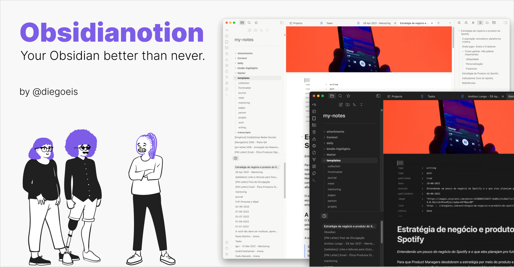

## Navigations

- [About and Screenshots](#about-obsidianotion)
- [To install](#to-install)
- [Plugins](#companion-plugins)

# About Obsidianotion

Your Obsidian with a similar look and feel of Notion. But it's better because it's Obisidian!
I know it can be challenging to migrate between tools, and the processn can greatly impact your productivity. That's why good design can help accelerate the learning curve by creating a familitar context of experience to hlep us focus on the only thing that matters: note-taking.

This theme can help people who are migrating from Notion to Obsidian to feel more comfortable with the new flow and interface. It can also be a beautiful theme for those who already use Obsidian frequently.


My graph view:


Settings modal:


Obsidianotion supports a wide number of alternate checkbox types. These allow you to call out tasks that are incomplete, canceled, rescheduled, etc. See below for availale checkbox types.


```
Basic checklists:
- [ ] to-do
- [/] incomplete
- [x] done
- [-] canceled
- [>] forwarded
- [<] scheduling

Extras checklists:
- [?] question
- [!] important
- [*] star
- ["] quote
- [l] location
- [b] bookmark
- [i] information
- [S] savings
- [I] idea
- [p] pros
- [c] cons
- [f] fire
- [k] key
- [w] win
- [u] up
- [d] down
```

_These are the same checkbox styles used in [Things](https://github.com/colineckert/obsidian-things) and [Minimal](https://minimal.guide/Block+types/Checklists#Checkbox+styling) themes. So, give it a try too._


## To install

1. Open the **Settings** in Obsidian;
1. Navigate to **Appearance** tab;
1. Under the **Themes** section, click on the `Manage` button across from **Themes**
1. Search for `Obsidianotion` in the Search field text
1. Click `Use` and then you're done! 🎉

## Companion plugins

To install the plugins that have a good fit with Obsidianotion:

- Go to `Community plugins` and turn off `Safe mode`
- Under community themes search for the plugins name and click `Install`, then `Enable`

The banner in this image was inserted using [Banner Plugin](https://github.com/noatpad/obsidian-banners).


This theme works very good using [Make.md plugin](https://github.com/Make-md/makemd).


 to create views using your tags, dataview or folders.


